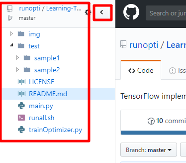
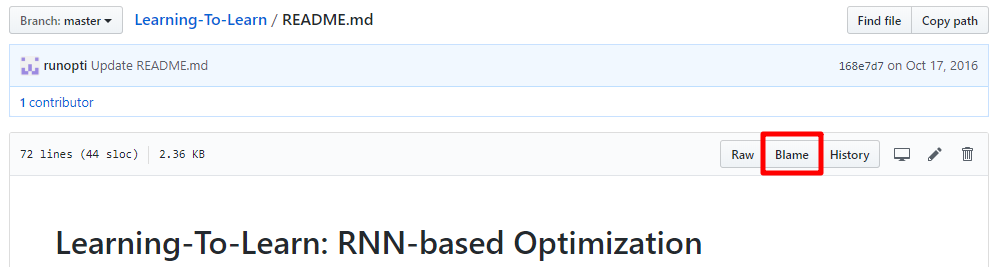

# Git Commands

## 关于Github的一些技巧

### 插件：**Octotree**

安装Octotree后，在打开GitHub仓库时，浏览器左侧会出现文件目录级别，查看很方便。

### 查看仓库初始代码

仓库最终呈现的代码都是修改完善过的，比较完整庞大，一开始看起来可能会比较费力。最开始提交的代码一般是比较核心，最基础的功能代码，看起来容易理解。这时就可以打开仓库的ReadMe.md，然后点击上方的**Blame**，就可以看到以前的版本了。

