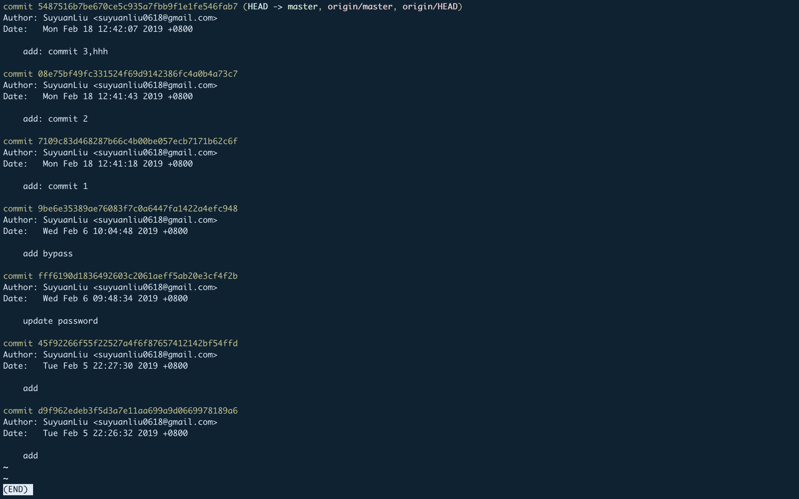
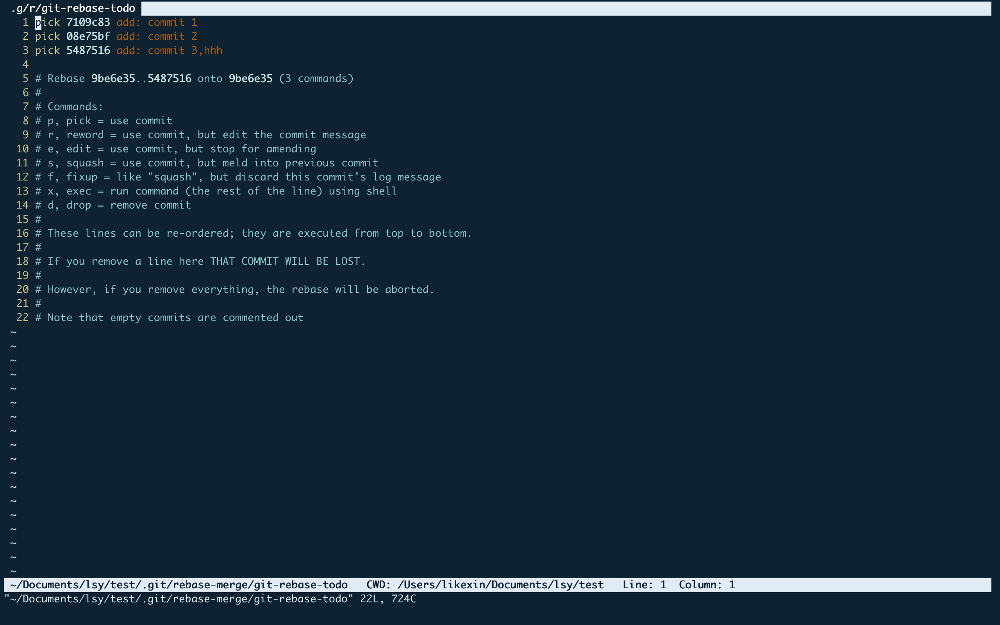
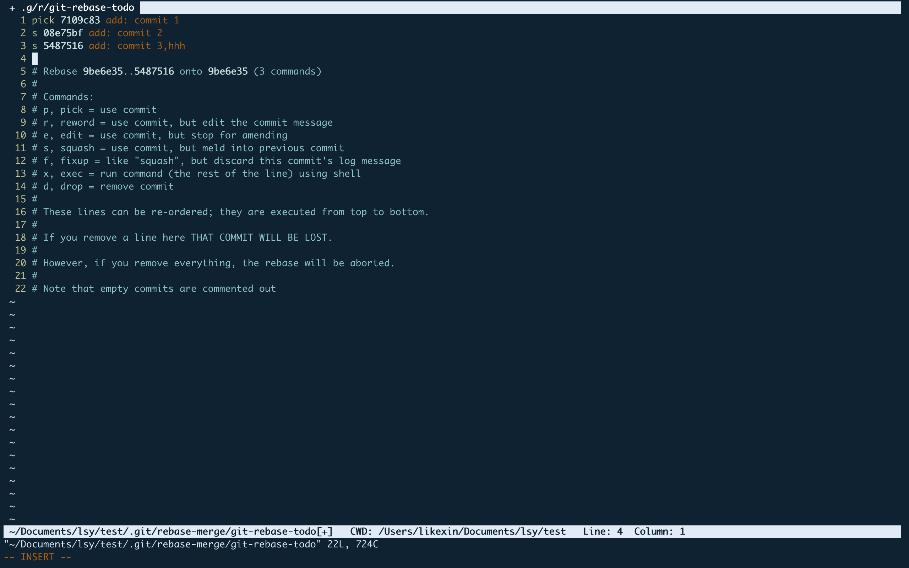
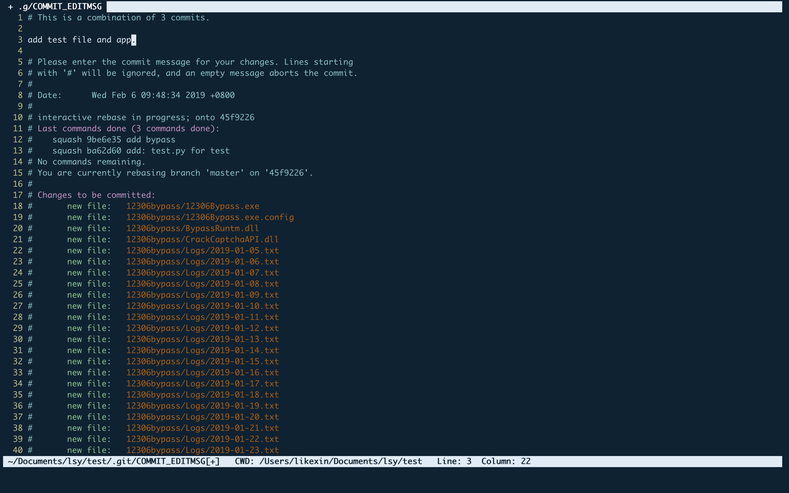

# Git Commands

- [基本命令](#基本命令)
- [git rebase](#git-rebase)

## 基本命令

``` git
git add .
git commit -m 'can be modified: info about your commit'
git push
```

## git rebase

有时只做了很小的改动也commit了，可以通过rebase，把最近的几次提交压缩为一次。

首先使用`git log`来查看最近提交的版本号（如下图），假设想把前三个版本的commit合并为一个，输入以下命令：

``` git
git rebase -i 9be6e
# or
git rebase -i HEAD～3    # more convinient
```

`git rebase -i 9be6e`: i 后面的是版本号（只写一部分即可），这个版本号前面的commit要被合并（⚠️注意：9be6e这个不会被合并）.

然后会弹出vim窗口，倒序列出commit情况,。

这边要了解两个命令：`pick，squach`。pick是要执行这个commit，squach是将这个commit合并到前一个commit。这边把后面两个commit前面的pick改为squach，或者简写s（按键i进入编辑状态），然后（按esc退出编辑状态）输入：wq，完成退出并保存。

这时又会弹出vim窗口，，是要编辑commit message，把前面的commit message删掉，直接换成新的即可，然后:wq退出保存，。

然后git log就可以看见之前的3个commit合并为一个了。

在github那边看commit状态依旧是4次，再用命令提交到远端即可：`git push --force origin master` or `git push -f`.


## 参考

https://blog.csdn.net/itfootball/article/details/44154121
