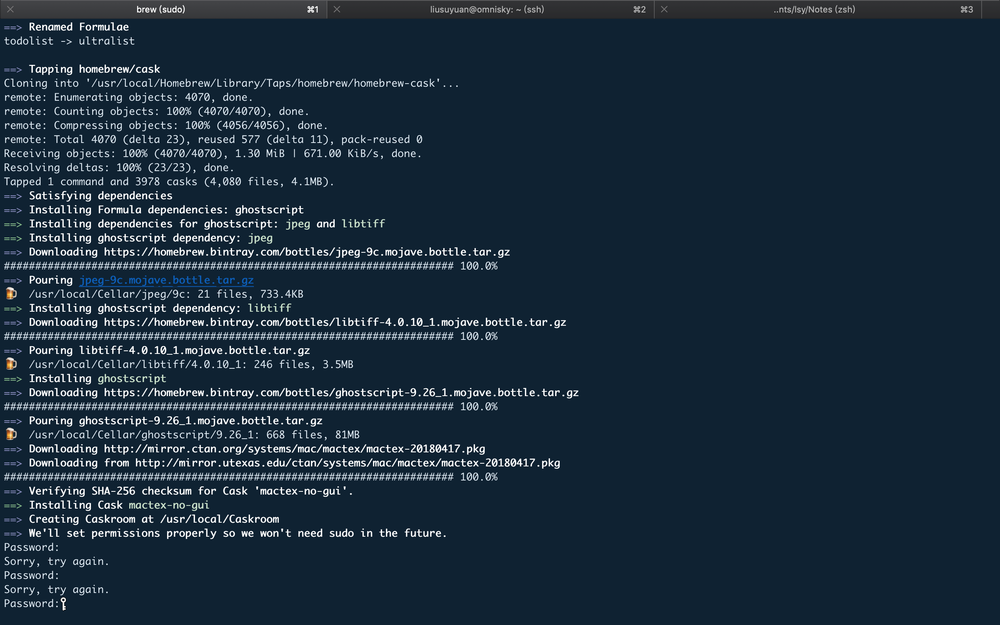

# Using latex with VScode

系统：MacOS
已安装：VS code

## 步骤

**安装无GUI的MacTex**

```
# macOS MacTex Install
brew cask install mactex-no-gui

# Updating the packages
sudo tlmgr update --self && sudo tlmgr update --all
```

让输入密码，用的瓜娃子的电脑，就是瓜娃子电脑密码，但是输入以后还是有错。


再次尝试，就又好了.

第二行命令输入，提示tlmgr不存在...还没解决；

****

## 参考

https://medium.com/@rcpassos/writing-latex-documents-in-visual-studio-code-with-latex-workshop-d9af6a6b2815