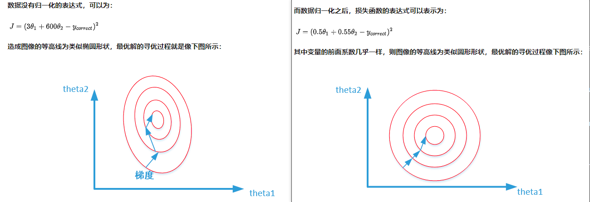
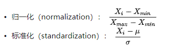

# 归一化 Normalization

Index
- [为什么要归一化](#为什么要归一化)
- [数据缩放本质](#数据缩放本质)
- [什么时候要做归一化](#什么时候要做归一化)
- [归一化有哪些方式](#归一化有哪些方式)

## 为什么要归一化

把不同维度的数据映射到同一个特定区间，或具备相同的数据分布，加速优化过程。（消除数据量纲）

下图两个图分别是归一化和未归一化损失函数的等高线。（以房间数，房间面积为例，预测房间价格）梯度下降方向是与等高线垂直的方向，所以左图比较曲折。归一化之后，每一次梯度下降方向都指向损失函数最小的方向。

如果不做归一化，有一种理解，从梯度不稳定的方向考虑：有的维度数据尺度比较大，那么对应的梯度比较大。而在梯度更新的时候，梯度大的和梯度小的前面乘的系数是相同的，如果系数比较小，梯度比较小的方向更新就会比较缓慢，如果乘的系数比较大，梯度大的方向就容易不收敛。（但这个只适用于解释基于梯度下降的模型）

## 数据缩放本质

归一化和标准化本质上都是一种线性变换（压缩再平移）。线性变化不改变原始数据的数值排序。线性变换保持线性组合与线性关系式不变，这保证了特定模型不会失效，

## 什么时候要做归一化

[参考](https://www.zhihu.com/question/30038463/answer/50491149)

看模型是否具有伸缩不变性。（看数据经过变换后的最优解，是否与原来模型的最优解等价，即经过相同的变换，是否能相同）

不具备伸缩不变性：有些模型在各个维度进行不均匀伸缩后，最优解与原来不等价，例如SVM。对于这样的模型，除非本来各维数据的分布范围就比较接近，否则必须进行标准化，以免模型参数被分布范围较大或较小的数据主导。

具备伸缩不变性：有些模型在各个维度进行不均匀伸缩后，最优解与原来等价，例如logistic regression（数据伸/缩，把相应的权重缩/伸同样的倍数，目标函数不变）。对于这样的模型，是否标准化理论上不会改变最优解。但是，由于实际求解往往使用迭代算法，如果目标函数的形状太“扁”，迭代算法可能收敛得很慢甚至不收敛。所以对于具有伸缩不变性的模型，最好也进行数据标准化。

注：regularization项不是伸缩不变的。

## 归一化有哪些方式

|方式|输出范围|说明|适用情况|
|--|--|----------|---|
|归一化|[0,1]|归一化的结果只跟最大值、最小值有关|输出范围有要求；数据比较稳定，不存在极端的最大最小值|
|0均值标准化（Z-score）|[-∞，+∞]（方差可能为0）|归一化结果与每一个值都相关|数据存在异常值和较多噪音，用标准化，可以间接通过中心化避免异常值和极端值的影响|

## 参考

- https://www.zhihu.com/question/20455227
